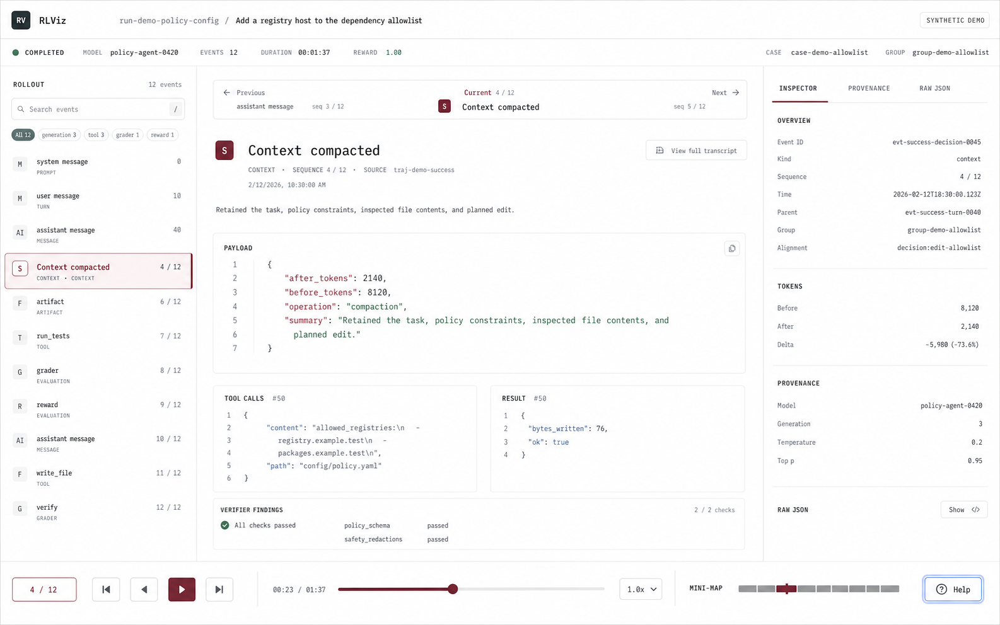

# Trajectory workspace V2

## Decision

The next trajectory workspace uses a light, editorial instrument language. It
keeps RLViz dense enough for research work, but makes one selected event the
clear reading object. Navigation, provenance, and playback support that object
instead of competing with it.

The image is a direction reference, not a pixel contract. Source truth,
accessibility, responsive behavior, and the canonical command registry take
precedence over details invented by the mockup.

## Hierarchy

The workspace has five levels, in this order:

1. selected event or turn: title, semantic type, sequence, summary, and payload
2. local context: compact previous/current/next orientation
3. linked evidence: tool call/result, verifier findings, artifacts, and reward
4. trajectory navigation: sparse landmark rail and whole-run transport
5. provenance: inspector, source location, normalized record, and raw JSON

Only one region should look selected. Keyboard focus is a separate cobalt ring;
selection uses oxblood. Pass, fail, warning, and inferred data retain their own
semantic labels and never rely on color alone.

## Application frame

At the 1440 x 900 reference viewport:

- run header: 48 px identity row plus 40 px outcome row
- landmark rail: 248 px default, adjustable from 216 to 320 px
- inspector: 320 px default, adjustable from 280 to 400 px
- primary surface: all remaining width, with a 72-85 character payload measure
- transport: 64 px, fixed to the bottom without covering content
- minimum supported desktop width: 1024 px

Below 1180 px, the inspector becomes a dismissible overlay. Below 1024 px, the
rail collapses to a landmark drawer and RLViz explains the reduced layout. The
primary reading surface never clips silently.

## Regions

### Run header

The first row contains RLViz, source/run identity, the task, and global actions.
The second row contains only known outcome facts: status, model/checkpoint,
event count, duration, reward, case, and group. Unknown data is omitted rather
than rendered as decorative dashes.

### Landmark rail

The rail is a sparse semantic index, not a second transcript. Default rows show
an icon, event or turn name, semantic label, and sequence. Search and filter
results may temporarily show every matching raw event.

The rail owns its scroll position. Selection changes may reveal the selected
row once, but rendering, payload expansion, inspector updates, and primary-pane
scrolling must not repeatedly call `scrollIntoView` on the rail. Manual rail
scroll remains stable until the user selects or navigates to another item.

### Local context strip

A thin strip above the event provides previous/current/next orientation. The
current item receives more visual weight, but the strip is not three equal
cards. Previous and next are compact summaries and direct navigation targets.

### Selected-event surface

The event header carries the semantic icon, human label, canonical kind,
sequence, source/provenance label, and timestamp. A source-backed summary may
precede the payload. JSON, messages, diffs, images, logs, and artifacts use
their appropriate renderer without changing the surrounding hierarchy.

Related records appear below the payload in semantic pairs or sections. Tool
calls stay paired with results. Verifier evidence links back to canonical event
IDs. Large or absent sections collapse without leaving empty chrome.

### Inspector

Tabs are `Inspector`, `Provenance`, and `Raw JSON`. The first tab begins with
selected-event identity, then kind-specific facts. Provenance owns model,
adapter, source, derivation, and analyzer information. Raw JSON is the lossless
escape hatch. Sections use whitespace and rules rather than nested cards.

### Transport

The bottom instrument combines event position, previous/play/next, speed,
timeline, and minimap. It reflects loaded versus unavailable extent and does
not imply continuous time when only sequence is known. The persistent shortcut
footer is removed; Help and the command palette are generated from the command
registry.

## Visual system

### Color

Initial light-theme targets:

| Token | Value | Use |
| --- | --- | --- |
| `--surface-canvas` | `#f5f4f1` | app background |
| `--surface-panel` | `#fbfaf7` | rail, inspector, transport |
| `--surface-reading` | `#fffefd` | primary event surface |
| `--text-primary` | `#202123` | prose and strong labels |
| `--text-secondary` | `#616267` | metadata |
| `--border-subtle` | `#deddd8` | structural rules |
| `--selection` | `#8a2633` | selected event and playhead |
| `--selection-soft` | `#f5e9eb` | selected row fill |
| `--focus` | `#356ae6` | keyboard focus only |
| `--success` | `#39775b` | passed and completed |
| `--warning` | `#9a6a22` | partial or caution |
| `--danger` | `#b43a3a` | errors and failures |
| `--tool` | `#426a9c` | tool semantics |
| `--inferred` | `#75618d` | explicitly inferred data |

Values may move during contrast testing, but their roles may not collapse.
Dark mode is a later mapping of the same semantic tokens, not the baseline for
the V2 implementation.

### Typography

- UI face: system sans stack; do not fetch fonts at runtime
- data face: system monospace stack
- event title: 24 px / 1.2, medium weight
- section title: 11 px / 1.3, medium, limited uppercase
- body and event names: 13-14 px / 1.5
- metadata: 11-12 px / 1.4
- payload: 12.5-13 px / 1.55
- essential text never falls below 10 px

Monospace is reserved for source data, IDs, paths, timestamps, numbers that
need column alignment, JSON, and keycaps. Product headings and controls use the
UI face.

### Spacing and shape

Use the existing 2, 4, 8, 12, 16, 24, and 32 px scale. The selected-event
surface uses 24-32 px section spacing. Rail rows use 12 px vertical and 16 px
horizontal padding in comfortable mode. Radii are 4 px for controls and 6 px
for bounded payload surfaces. Panels do not become floating rounded cards.

Borders establish large regions and data boundaries only. A page should not
need a border around every message, property group, or control cluster.

## Interaction contract

All keyboard behavior routes through stable command IDs. Component-local
global key handlers are prohibited.

- `j` and `k` move to the next and previous navigable item in the active scope.
- Commands are suppressed while typing in inputs, textareas, editable content,
  native selects, or dialogs unless explicitly allowed.
- Selection moves semantic state; focus remains where the command originated
  unless a command explicitly opens or closes a surface.
- Mouse selection, keyboard selection, URL restoration, and search selection
  use one selection function with an explicit reveal reason.
- Reveal runs once after a user navigation or deep-link restore. It does not
  run after unrelated renders or virtual-list measurement.
- Focus and selection are simultaneously visible and visually distinct.
- Help, displayed key hints, settings, and conflict detection all read from the
  central command registry.

## Required states

Every core region needs default, hover, keyboard focus, selected, disabled,
loading, empty, partial, stale, and error coverage. The trajectory workspace
also needs explicit states for:

- selected item outside the current filter
- selected item outside the rail viewport
- event not loaded yet
- source appended while viewing
- inferred turn grouping
- missing context accounting
- failed verifier versus infrastructure failure
- inspector collapsed and inspector overlay
- reduced motion

## Acceptance checks

The V2 trajectory workspace is ready only when:

- a researcher can identify outcome, selected event, local context, and linked
  evidence in five seconds without opening raw JSON
- manual rail scrolling is not pulled back to the selected row
- 100 repeated `j`/`k` commands produce 100 deterministic selection changes
  when focus is outside text entry
- the same keys type normally in search, keymap inputs, and editable payloads
- focus never disappears after closing Help, Raw JSON, or the inspector overlay
- deep links restore the selected event and reveal it exactly once
- the 10,000-event fixture keeps bounded DOM size and responsive navigation
- 1440 x 900 and 1280 x 800 screenshots pass intentional visual review
- axe reports no serious or critical issues on the loaded workspace
- normal viewing produces no outbound network requests

